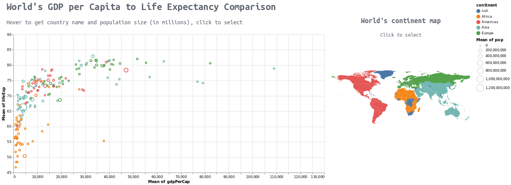

# <b>Final result report</b>

 
So in the end we've got interactive plot which you can zoom in and move around by scrolling the mouse wheel and dragging. Also when the mouse is over some point it shows the name of that country and it's population in millions. When you click on the country other countries from the same continent are selected but with lower opacity and everything else is shown in light gray color. Also the corresponding continent will be shown on the map to the right from main chart. You can also click on that map to select countries from particular continent. Apart from that you can select particular year to get the data only based on it. 

 Link to colab: https://colab.research.google.com/drive/1CNM4Y9uaqE464NDSZZrSlFwfo2o1gbzN?authuser=1#scrollTo=OUTkmKZ7tV_A
